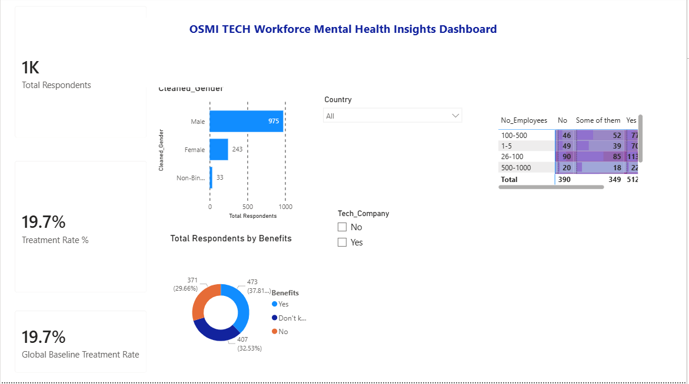
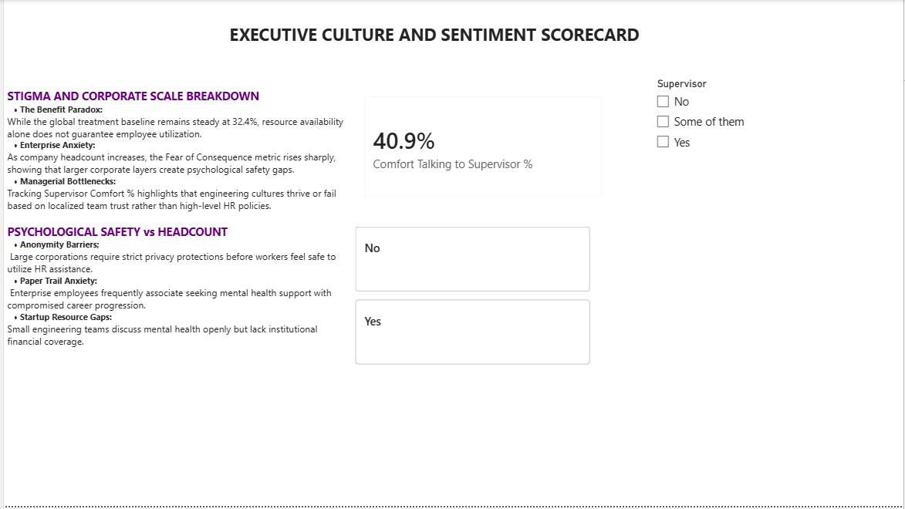

# osmi-mental-health-analytics
An end-to-end data analytics project using SQL and Power BI to evaluate workplace mental health trends and psychological safety metrics in the tech industry.
This project provides a comprehensive, data-driven analysis of mental health trends in the tech industry using data from the Open Sourcing Mental Illness (OSMI) survey hosted on Kaggle. The goal is to uncover how corporate environments, company sizes, and demographic factors influence employee choices to seek treatment and disclose mental health struggles.By engineering a robust SQL pipeline for data extraction, transformation, and loading (ETL), and designing an interactive Power BI dashboard, this project delivers actionable insights into corporate wellness gaps and global healthcare adoption trends
##Dashboard Visuals

###Tech Stack & Tools Used
***Database Management: Microsoft SQL Server / T-SQL (Data Cleaning, Transformation, View Creation)Business Intelligence: Microsoft Power BI Desktop (Data Modeling, DAX, Visual Design)
***Data Analysis Expressions (DAX): Advanced measures for dynamic KPIs and custom sort metrics
***Data Source: OSMI Mental Health in Tech Survey (Kaggle)
###Data Engineering Pipeline (SQL)The raw survey data contained structural noise, unformatted textual responses.
'''sql
__Checking distribution and flagging anomalous age records
SELECT Age, COUNT(*) AS Total_Responses
FROM survey
GROUP BY Age
ORDER BY Total_Responses DESC;
__Filtering target workforce demographics
SELECT 
    Age, 
    COUNT(*) AS Number_Of_Employees
FROM survey
WHERE TRY_CAST(Age AS INT) BETWEEN 18 AND 75
GROUP BY Age
ORDER BY TRY_CAST(Age AS INT) ASC;
### Standardized Views & Text NormalizationThe Gender column contained highly fragmented, free-text entries. A consolidated SQL view was constructed to categorize genders cleanly, filter ages safely into a [18, 75] working range, and provide a normalized foundation for the Power BI storage engine.sql
 CREATE VIEW v_CleanedMentalHealthData AS
SELECT 
    TRY_CAST(Age AS INT) AS Cleaned_Age,
    CASE 
        WHEN LOWER(Gender) IN ('male', 'm', 'male ', 'man', 'cis male', 'cis man') THEN 'Male'
        WHEN LOWER(Gender) IN ('female', 'f', 'female ', 'woman', 'cis female', 'cis woman') THEN 'Female'
        ELSE 'Non-Binary/Other'
    END AS Cleaned_Gender,
    Country,
    State,
    Self_Employed,
    Family_History,
    Treatment,
    Work_Interfere,
    No_Employees,
    Remote_Work,
    Tech_Company,
    Benefits,
    Care_Options,
    Wellness_Program,
    Seek_Help,
    Anonymity,
    Leave,
    Mental_Health_Consequence,
    Phys_Health_Consequence,
    Coworkers,
    Supervisor,
    Comments
FROM survey
WHERE TRY_CAST(Age AS INT) BETWEEN 18 AND 75;
###Aggregations & Business Intelligence Logic
Exploratory aggregations were executed directly within SQL to calculate core benchmarks, such as treatment percentages categorized by organizational scale and physical workplace architecture (Remote vs. On-site).sql
-- Evaluating treatment demand based on corporate size
SELECT 
    No_Employees AS Company_Size,
    COUNT(*) AS Total_Respondents,
    SUM(CASE WHEN Treatment = 'Yes' THEN 1 ELSE 0 END) AS Sought_Treatment,
    ROUND(CAST(SUM(CASE WHEN Treatment = 'Yes' THEN 1 ELSE 0 END) AS FLOAT) / COUNT(*) * 100, 2) AS Treatment_Percentage
FROM v_CleanedMentalHealthData
GROUP BY No_Employees
ORDER BY Treatment_Percentage DESC;
###Semantic Data Modeling & DAX Measures
The refined views were imported into Power BI. To support multi-layered slicing without hurting report performance, the following advanced DAX measures were structured.
Core Count and Evaluation KPIsdax
// Establishes the exact dataset footprint
Total Respondents = COUNTRows(v_CleanedMentalHealthData)

// Filters out cases where help was actively sought
Sought Treatment = 
CALCULATE(
    COUNTROWS('v_CleanedMentalHealthData'),
    'v_CleanedMentalHealthData'[Seek_Help] = "Yes"
)
// Computes dynamic, formatted treatment rates
Treatment Rate % = 
FORMAT(
    DIVIDE([Sought Treatment], [Total Respondents], 0), 
    "0.0%"
)

// Computes a context-immune global benchmark for visualization overlays
Global Baseline Treatment Rate = 
CALCULATE(
    [Treatment Rate %], 
    ALLSELECTED('v_CleanedMentalHealthData')
)
.Organizational Sentiment & Sentiment Ratesdax
// Tracks the proportion of the workforce fearing career penalties for mental health struggles
Fear of Consequence Rate = 
DIVIDE(
    CALCULATE([Total Respondents], 'v_CleanedMentalHealthData'[mental_health_consequence] = "Yes"),
    [Total Respondents],
    0
)

// Evaluates upper-management communication openness and trust
Comfort Talking to Supervisor % = 
DIVIDE(
    CALCULATE([Total Respondents], 'v_CleanedMentalHealthData'[supervisor] = "Yes"),
    [Total Respondents],
    0
)
Custom Ordering EngineBecause text-based company size classifications (e.g., "1-5", "100-500") sort incorrectly in alphabetical structures, a custom context index map was generated using a SWITCH block:daxCompany_Size_Sort = 
SWITCH(
    TRUE(),
    'v_CleanedMentalHealthData'[No_Employees] = "1-5", 1,
    'v_CleanedMentalHealthData'[No_Employees] = "6-25", 2,
    'v_CleanedMentalHealthData'[No_Employees] = "26-100", 3,
    'v_CleanedMentalHealthData'[No_Employees] = "100-500", 4,
    'v_CleanedMentalHealthData'[No_Employees] = "500-1000", 5,
    'v_CleanedMentalHealthData'[No_Employees] = "More than 1000", 6,
    7
)
the data analytic insights after deep diving into datasets
The Benefit Paradox: Access vs. Utilization
The Insight: A significant portion of respondents work in organizations offering mental health benefits, yet the actual treatment rate remains conservative at 32.4%.
The Strategic Breakdown: Providing an insurance policy or an Employee Assistance Program (EAP) is only half the battle. When cross-referenced with your Benefits donut chart, data reveals that availability does not automatically translate to utilization. Employees frequently fail to seek help due to a lack of internal program visibility or hidden cultural stigmas within engineering teams.
The Scale Disconnect: Growth vs. Psychological Safety
The Insight: Analyzing the Company_Size_Sort and No_Employees matrix shows that employee experiences split significantly as companies scale from startups (1-5 employees) to large enterprises (1000+ employees).
The Strategic Breakdown: Small startups show highly tight-knit, direct support structures, but lack formal HR benefits. Conversely, large enterprise environments offer comprehensive wellness programs, but exhibit a higher Fear of Consequence Rate. As headcount increases, corporate layers distance employees from decision-makers, making them more hesitant to disclose struggles out of fear of stalling their career progression or promotions.
 Management Trust Bottlenecks
The Insight: Your engineered DAX measure Comfort Talking to Supervisor % serves as a core health indicator for engineering culture.
The Strategic Breakdown: In teams where this metric trends low, there is a direct correlation with delayed mental health intervention, resulting in higher long-term turnover rates. Tech cultures that actively train engineering managers to hold empathetic, stigma-free 1-on-1 conversations see significantly higher psychological safety scores and faster resolutions to workplace burnout.
